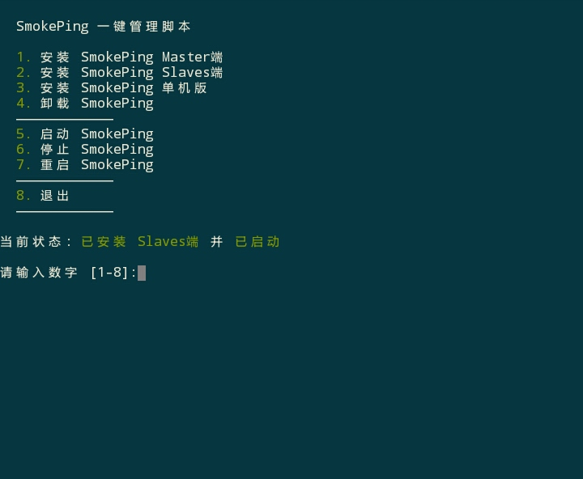
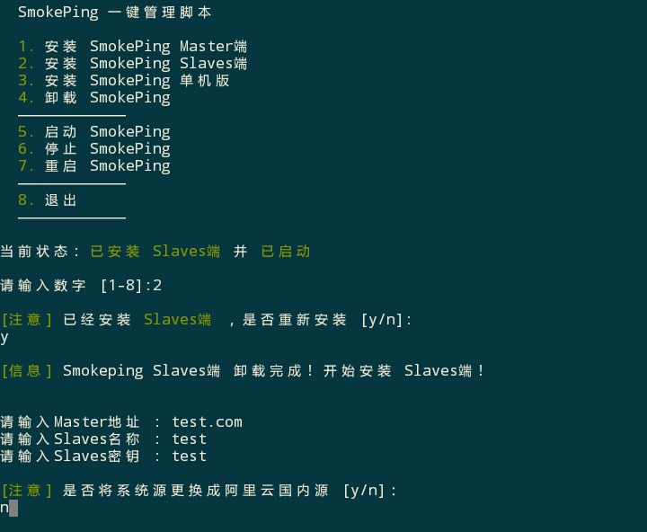

# SmokePing一键管理脚本 #

## 介绍 ##
一个Shell脚本，集成SmokePing三种版本(Master/Slaves/单机版)安装、启动、停止、重启等基本操作，方便用户操作。

[https://www.sabia.cc/smokeping-onekey.html](https://www.sabia.cc/smokeping-onekey.html)

## 系统支持 ## 
* CentOS 7

## 功能 ##
- 一键启动、停止、重启SmokePing服务
- 一键安装、卸载SmokePing三种版本
- 自动更换阿里云国内源(可选)
- 支持中文显示
- 覆盖安装提醒

## 缺点 ##
- 当前仅适配CentOS7系统
- 未设置开机启动
- Master端/单机版会自动安装Nginx并修改Nginx默认配置

## 注意事项 ##
- 请尽量确保服务器环境干净，最好重新安装系统后使用此脚本
- 本脚本只为方便用户安装/管理SmokePing，请用户自行配置SmokePing
- 每次修改SmokePing配置文件后请重启SmokePing

## 安装/卸载 ##
    wget -N --no-check-certificate https://raw.githubusercontent.com/ILLKX/smokeping-onekey/master/smokeping.sh && bash smokeping.sh

## 截图 ##

## 参考资料 ##
[CentOS7详细安装配置SmokePing教程-来自lala.im](https://lala.im/2821.html)

[SmokePing主从服务器详细配置教程-来自lala.im](https://lala.im/2867.html)

[参考mt-proxy安装脚本部分代码](https://github.com/ToyoDAdoubi/doubi)
